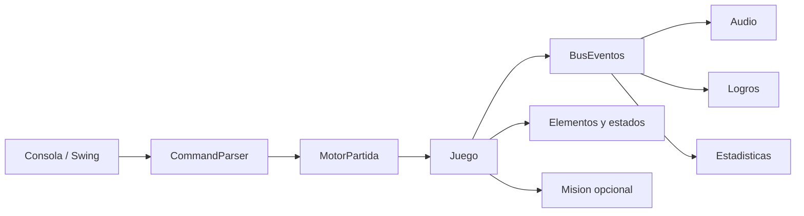
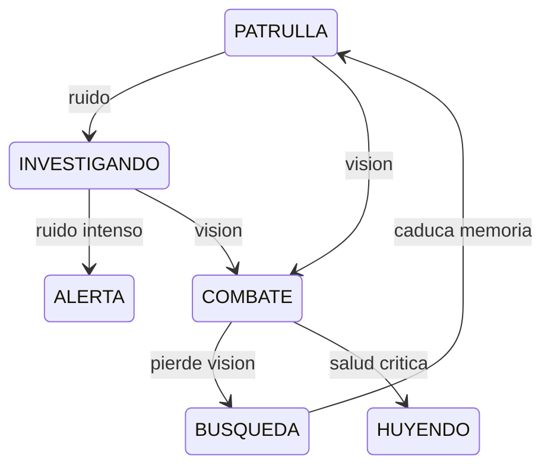

# Arquitectura roguelike

## Modulos

- `events`: bus sincrono por partida, reloj inyectable y eventos de dominio.
- `effects`: estrategias temporales y `GestorEstados` por personaje.
- `model.elements`: puertas, terminales, trampas, cobertura y destruccion.
- `inventory`: intercambio transaccional y recetas de crafting.
- `ai`: percepcion, ruido, memoria y maquina State/Strategy.
- `missions` y `progression`: objetivos, campana, XP y habilidades.
- `procedural`: habitaciones, laberintos y cuevas reproducibles.
- `persistence`: savegame versionado y replay con huella final.
- `achievements` y `stats`: proyecciones desacopladas que escuchan eventos.

`MotorPartida` conserva la orquestacion historica. Las nuevas reglas residen en
servicios y agregados especializados; consola y Swing siguen usando el mismo
`Juego` y el mismo parser.

## Flujo de turno e IA

El turno procesa efectos iniciales, accion, aliados, NPC, incendios y efectos
finales. La decision de IA produce una `AccionIA` explicable antes de ejecutarla.

## Compatibilidad

- Los constructores antiguos de `Arma` crean explicitamente armas de municion
  infinita para no romper escenarios historicos; las armas nuevas deben declarar
  cargador y `TipoMunicion`.
- Sin `Mision`, `Juego.jugadorGano()` usa la condicion de victoria original.
- TXT y JSON previos cargan sin campos de elementos. El JSON ampliado añade
  valores opcionales y validacion de IDs y conectividad.
- Campana, estadisticas persistentes, savegame y replay son opcionales.

## Persistencia y replay

`escenario.json` describe una plantilla. `partida.json` captura estado mutable,
incluidos elementos interactivos, progresion, estadisticas y logros, y usa
`PartidaGuardada.VERSION_ACTUAL`. `ReplayPartida` registra seed, configuracion,
comandos y hash SHA-256; reproducir vuelve a ejecutar comandos sobre una fabrica
determinista y compara la huella final.

## Extensiones

Para un estado nuevo se implementa `EfectoEstado`; para un enemigo, un rol
`EnemigoTactico`; para una mision, `ObjetivoMision`; para un mapa, `GeneradorMapa`.
Ninguno exige modificar los adaptadores de consola y GUI.
