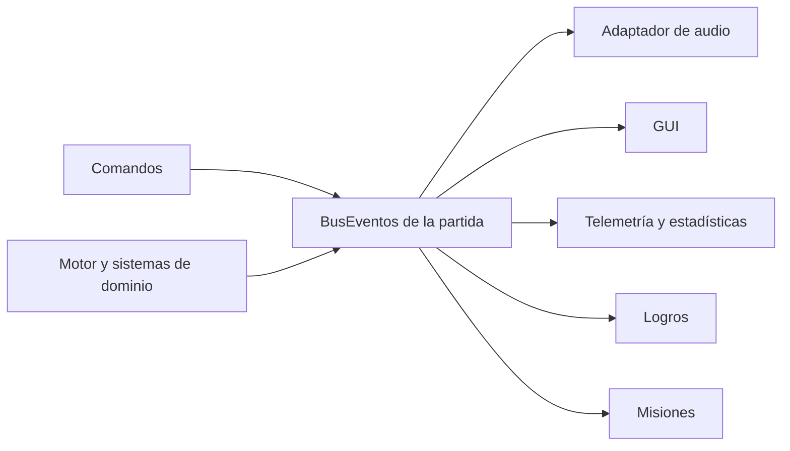

# Eventos de dominio

Cada `Juego` posee su propio `BusEventos`; no existe un bus global ni estático. Los
servicios publican hechos ya consumados y los adaptadores se suscriben por tipo. La
entrega es síncrona, conserva el orden de suscripción y usa una instantánea de los
listeners, por lo que una alta o baja durante una publicación no altera el despacho
en curso. Una excepción de un listener queda aislada y se entrega al manejador de
errores opcional sin impedir que continúe el resto.

`BusEventos` recibe un `Clock` inyectable. Los productores obtienen el instante con
`juego.getBusEventos().ahora()`, de modo que pruebas, guardados y replays pueden
usar una fuente temporal fija. `Suscripcion.close()` es idempotente.

## Catálogo inicial

- Personajes: `PersonajeMovido`, `PersonajeAtacado`, `PersonajeDanado`,
  `PersonajeCurado` y `PersonajeMuerto`.
- Inventario: `ObjetoRecogido`, `ObjetoUsado` y `ObjetoTirado`.
- Mundo: `CeldaInspeccionada`, `PuertaAbierta`, `PuertaCerrada`,
  `IncendioIniciado`, `IncendioPropagado` e `IncendioExtinguido`.
- Trampas: `TrampaDetectada`, `TrampaActivada` y `TrampaDesactivada`.
- Progresión: `AliadoEvacuado`, `MisionCompletada`, `EstadoAplicado` y
  `EstadoEliminado`.
- Percepción: `RuidoGenerado`.

El primer consumidor desacoplado es `SuscriptorAudioEventos`. Traduce hechos de
movimiento, combate, objetos e incendios a sonidos posicionales a través del puerto
`ReproductorSonido`, que puede sustituirse sin dispositivo de audio durante las
pruebas headless.

## Extensión

Un evento nuevo implementa `EventoJuego`, normalmente mediante un `record`, y
expone siempre un `Instant`. Un consumidor se registra contra el tipo más concreto
que necesite o contra `EventoJuego` para observar el flujo completo. Los listeners
no deben modificar el hecho recibido ni depender de un orden distinto al de su
registro.
