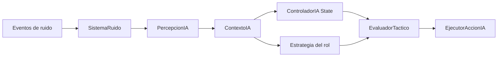

# IA táctica y armamento por rol

La IA nueva separa percepción, evaluación y ejecución. `SistemaTurnosIA` crea un
`ContextoIA`, `EvaluadorTactico` combina el nivel de alerta con la estrategia del
tipo de enemigo y `EjecutorAccionIA` realiza una única acción usando el `Random`
inyectado por el motor.

## Competencias

| Personaje | Familias que sabe usar | Carga habitual |
|---|---|---|
| Marine | melé, arrojadizas, armas de fuego y pesadas | armas comunes y pesadas |
| Francotirador | arrojadizas, arco, ballesta y fuego de precisión | arco, ballesta o rifle |
| Zapador | melé, arrojadizas, fuego, pesadas y demolición | explosivos y armas pesadas |
| Aliado | melé, arrojadizas, arco, ballesta y fuego común | excluye pesadas y cohetes |
| Berserker | melé | mandoble |
| Medic | arrojadizas y fuego común | pistola |
| Sniper | ballesta y fuego de precisión | rifle |
| Pyro | melé y fuego | proyector de energía y granada incendiaria |
| Scout | arrojadizas y fuego común | cuchillos arrojadizos |
| Commander | melé y fuego, incluidas pesadas | rifle |
| CommanderPrime | melé y fuego pesado | arma pesada |
| PyroOverlord | melé y fuego | proyector de energía y granada incendiaria |

Las granadas son utilizables por las clases entrenadas; los explosivos de
demolición siguen reservados al Zapador. Recoger un arma no concede competencia:
`ReglasArmamento` valida el equipamiento, tanto para jugador y aliados como para
enemigos. Esto permite recuperar botín enemigo sin que todos los personajes sepan
usar automáticamente todas las armas.

## Recursos y botín

- Todas las armas explícitas usan cargadores finitos salvo las de melé.
- Arcos, ballestas y cuchillos arrojadizos consumen flechas, virotes y cuchillos.
- Un enemigo recarga como acción de turno cuando su arma queda vacía.
- Pyro y PyroOverlord consumen primero una granada incendiaria y después cargas de
  su arma para generar fuego.
- Al morir, el enemigo deja exactamente sus armas equipadas y su reserva restante;
  el servicio vacía sus referencias para impedir duplicaciones.
- La dificultad escala la reserva inicial, no crea munición durante la partida.

## Estados de alerta

`PATRULLA`, `SOSPECHA`, `INVESTIGANDO`, `ALERTA`, `COMBATE`, `BUSQUEDA`,
`HUYENDO` y `PROTEGIENDO` son estados explícitos. Los ruidos se distribuyen por el
bus de eventos de la partida, respetan intensidad y audición, y conservan una
memoria temporal de la última posición detectada. La oscuridad reduce el alcance
visual y la línea de ataque sigue siendo obligatoria.

Los jefes ejecutan una habilidad especial una sola vez por fase. CommanderPrime
inspira, invoca refuerzos ya armados, fortifica y entra en ofensiva final;
PyroOverlord amplía progresivamente la zona incendiada.
