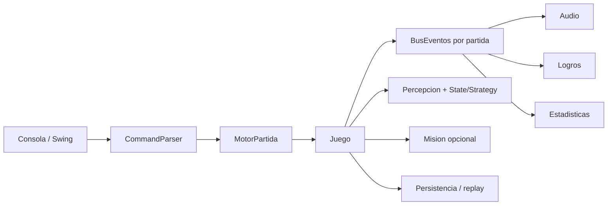

# Informe final de ampliacion roguelike

Fecha de auditoria: 12 de agosto de 2026. Rama de entrega: `main`.

## 1. Resumen de arquitectura nueva

El motor historico sigue siendo compartido por consola y Swing. Las ampliaciones se
han distribuido en servicios y agregados cohesionados: `events`, `effects`,
`model.elements`, `inventory`, `ai`, `missions`, `progression`, `procedural`,
`persistence`, `achievements`, `stats` y `audio`. Cada partida posee su propio
`BusEventos`; no existe un bus global estatico.



## 2. Funcionalidades implementadas

- Eventos de dominio sincronicos, deterministas y resistentes a listeners fallidos.
- Nueve estados temporales, acumulacion/renovacion e interacciones fuego-agua-descanso.
- Puertas, credenciales, terminales, interruptores, cofres, barricadas y paredes debiles.
- Minas y trampas de fuego, veneno, electricidad y alarma, con ventaja del zapador.
- Municion finita, recarga, cargadores, botin real e intercambio atomico.
- Cobertura orientada, flanqueo, precision con RNG inyectable y destruccion estructural.
- Ruido, oscuridad, memoria, alertas y ocho estados formales de IA.
- Seis roles enemigos, dos jefes por fases y armamento tactico propio.
- Misiones, objetivos secundarios, campana, XP, niveles y arboles extensibles.
- Crafting, terreno destructible, tres generadores procedurales y semillas CLI.
- Savegame versionado, replay SHA-256, logros y estadisticas persistibles.
- Editor y GUI ampliados, audio por eventos, Docker/noVNC y Javadoc web.

## 3. Clases nuevas principales

- Eventos: `EventoJuego`, `BusEventos`, `Suscripcion` y los records de `events`.
- Estados: `EfectoEstado`, `GestorEstados`, `EstadoActivo` y nueve estrategias.
- Mapa: `ElementoMapa`, `ElementoBase`, `Puerta`, `Terminal`, `Interruptor`,
  `Cofre`, `Barricada`, `ParedDebil` y las cinco trampas.
- Inventario: `ServicioRecarga`, `ServicioIntercambio`, `CooperacionInventario`,
  `SistemaFabricacion`, `CatalogoRecetas`, `Municion` y `Granada`.
- IA: `ControladorIA`, `EstadoIA`, `PercepcionIA`, `EvaluadorTactico`,
  `EjecutorAccionIA`, `SistemaRuido`, `SistemaTurnosIA` y `SistemaJefes`.
- Metajuego: `Mision`, objetivos de `missions`, `Campana`, `ProgresionPersonaje`,
  `ArbolHabilidades`, `GestorLogros` y proyecciones de estadisticas.
- Reproducibilidad: los tres `GeneradorMapa`, `PersistenciaPartida`,
  `PersistenciaCampana`, `ServicioReplay` y sus DTO versionados.
- GUI: `PanelAcciones`, `PanelEstado` y `PanelRegistro`.

## 4. Clases refactorizadas

`Juego` integra eventos, mision, estadisticas y logros por instancia;
`Personaje` integra estados, progresion y competencias; `Arma` conserva su
constructor historico y admite familia, cargador y municion; `MotorPartida`
orquesta servicios; `SistemaCombate` aplica precision, ruido, habilidades y
destruccion; `PanelJuego` delega componentes; los cargadores y el serializador
JSON admiten campos nuevos con valores predeterminados.

## 5. Comandos nuevos

```text
recargar [arma]                 estado arma
dar <objeto> <aliado>          pedir <objeto> <aliado>
intercambiar <obj1> <obj2> <aliado>
abrir puerta                   cerrar puerta
usar llave                     usar tarjeta
hackear terminal               activar interruptor
inspeccionar trampa            desactivar trampa
recetas                        fabricar <resultado>
guardar partida [archivo]      cargar partida [archivo]
estadisticas                   logros
```

## 6. Eventos nuevos

`PersonajeMovido`, `PersonajeAtacado`, `PersonajeDanado`, `PersonajeCurado`,
`PersonajeMuerto`, `ObjetoRecogido`, `ObjetoUsado`, `ObjetoTirado`,
`CeldaInspeccionada`, `PuertaAbierta`, `PuertaCerrada`, `TrampaDetectada`,
`TrampaActivada`, `TrampaDesactivada`, `IncendioIniciado`,
`IncendioPropagado`, `IncendioExtinguido`, `AliadoEvacuado`,
`MisionCompletada`, `EstadoAplicado`, `EstadoEliminado`, `RuidoGenerado` y
`ArmaRecargada`.

## 7. Estados nuevos

`Quemado`, `Envenenado`, `Sangrado`, `Aturdido`, `Cegado`, `Mojado`,
`Exhausto`, `Asustado` e `Inspirado`. Agua elimina fuego/quemado, el descanso
reduce agotamiento y las resistencias/equipamiento modifican su aplicacion.

## 8. Enemigos, jefes y armamento

Los roles `Berserker`, `Medic`, `Sniper`, `Pyro`, `Scout` y `Commander` tienen
decisiones distinguibles. `CommanderPrime` y `PyroOverlord` cambian entre cuatro
fases. El arsenal incluye espada, cuchillo, cuchillos arrojadizos, arco,
ballesta, pistola, rifle, arma pesada, energia, cohetes y granadas.

Competencias decididas:

- Marine: mele, arrojadizas, armas de fuego, pesadas y granadas; no arco.
- Francotirador: arrojadizas, arco, ballesta y fuego de precision; no pesada.
- Zapador: mele, arrojadizas, pesada, cohetes, granadas y demolicion.
- Aliados: familias comunes, arco/ballesta y arrojadizas; no armamento pesado.
- Enemigos/jefes: perfil restringido por rol; recargan, consumen reservas y
  sueltan arma y municion restante una sola vez.

## 9. Misiones y campana

Se soportan salida, eliminar enemigo/jefe, rescate, recuperacion, terminal,
supervivencia, escolta, incendio, cero bajas y sin disparar. Una mision sustituye
la victoria original solo cuando existe. El editor configura objetivo principal,
secundario y recompensas; `Campana` encadena misiones de forma opcional.

## 10. Persistencia añadida

`partida.json` usa `version: 1` y conserva mapa mutable, fuego, paredes y
coberturas dañadas, puertas, trampas, personajes, salud, energia, inventario,
armas/cargadores, estados, progresion, mision, puntuacion, logros, estadisticas y
celdas inspeccionadas. El escenario y la partida en curso son formatos separados.
`ReplayPartida` guarda seed, configuracion, comandos y huella final.

## 11. Pruebas añadidas

La suite contiene 165 pruebas JUnit 5 sin fallos: unitarias, integracion,
parametrizadas, GUI headless, procedural, persistencia y replay. Hay cobertura
explicita de eventos, estados, puertas, trampas, municion, competencias,
intercambio, cobertura, IA/ruido, roles, jefes, misiones, campana, habilidades,
crafting, destruccion, procedural, savegame, logros, estadisticas y Swing.

## 12. Cobertura final

- Lineas: **74,55 %** (`6491/8707`).
- Ramas: **56,53 %** (`2545/4502`).
- Umbral JaCoCo exigido: 70 % de lineas; no se redujo.

## 13. Resultado de Maven

`mvn --batch-mode --no-transfer-progress clean verify`: **BUILD SUCCESS**.
Compila 282 fuentes, ejecuta 165 pruebas, empaqueta el JAR ejecutable y genera
JaCoCo y Javadoc.

## 14. Analisis estatico y seguridad

- Checkstyle: 0 violaciones.
- SpotBugs: 0 bugs, 0 errores.
- Maven Enforcer: Java, Maven y convergencia de dependencias correctos.
- OWASP Dependency-Check: perfil `security`, fallo a partir de CVSS 7 y job CI
  dedicado con caché NVD semanal; una primera sincronizacion local puede tardar
  mas de diez minutos.

## 15. Compatibilidad mantenida

Siguen funcionando los TXT y JSON historicos, constructores y comandos antiguos,
consola, Swing, editor, escenarios grandes/50 variantes, dificultades, audio,
Docker, noVNC y Javadoc web. Los campos JSON nuevos son opcionales y se
normalizan con valores predeterminados.

## 16. Problemas pendientes

No hay TODO critico ni regresion conocida. La auditoria NVD local en una cache
vacia es costosa; el job dedicado de CI es la ejecucion autoritativa y cacheada.

## 17. Riesgos tecnicos

`MotorPartida` y `Personaje` siguen siendo clases historicas grandes. Las reglas
nuevas se extrajeron a servicios, pero una futura iteracion puede separar por
completo la orquestacion de aliados y comandos sin cambiar su API. Campana y
savegame se guardan por servicios distintos, por lo que una aplicacion futura
podria ofrecer un manifiesto unico que los agrupe.

## 18. Commits de la ampliacion

```text
5670ee7 feat(events): add deterministic domain event bus
1660519 feat(effects): add reusable temporary status system
a875fe8 feat(map): add interactive elements traps and cover
7d3365f feat(inventory): add finite ammo reload and exchanges
b74aa08 feat(ai): arm tactical enemies and bosses
915730d feat(game): add missions procedural saves and meta systems
5b13a17 docs(build): document expansion and harden quality gates
73ae280 Centralize crafting recipes and strengthen domain validation
639f89d feat(tactics): apply skills and destructible terrain
8626b05 refactor(gui): split tactical game panels
f924507 feat(squad): prioritize allied support and deployment
ed048e0 fix(savegame): persist destructible weak walls
22b34ff feat(editor): expose tactical loot hazards and alerts
d2876e0 Añade soporte para cargar y validar misiones en escenarios JSON
c80ed1a feat(missions): configure objectives from scenario editor
```

## 19. Instrucciones exactas de ejecucion

```powershell
mvn clean verify
java -jar target/the-legend-of-tecla.jar --rapido
java -jar target/the-legend-of-tecla.jar --rapido --modo procedural --seed 12345
java -jar target/the-legend-of-tecla.jar --gui
java -jar target/the-legend-of-tecla.jar --editor
docker compose up --build --detach gui javadoc-web
```

GUI noVNC: `http://127.0.0.1:6080/vnc.html?autoconnect=1&resize=scale`.
Javadoc: `http://127.0.0.1:8081/`.

## 20. Ejemplos de comandos

```text
mirar
equipar arco compuesto
estado arma
recargar arco compuesto
atacar 4e sniper_1
dar Balas Aliado_1
abrir puerta
usar tarjeta
inspeccionar trampa
desactivar trampa
fabricar mina
guardar partida saves/operacion.json
estadisticas
```

## 21. Ejemplos JSON

```json
{
  "tipo": "arma",
  "nombre": "Ballesta tactica",
  "descripcion": "Arma silenciosa de dos manos",
  "peso": 4.0,
  "valor": 24,
  "dosManos": true,
  "categoriaArma": "BALLESTA",
  "tipoMunicion": "VIROTE",
  "capacidadCargador": 1,
  "municionActual": 1,
  "fila": 2,
  "columna": 3
}
```

```json
{
  "mision": {
    "id": "reactor",
    "nombre": "Apagar el reactor",
    "principal": {
      "tipo": "activar_terminal",
      "argumento": "terminal-reactor",
      "valor": 1
    },
    "secundarios": [
      {"tipo": "no_perder_aliados", "argumento": "", "valor": 0}
    ],
    "recompensas": ["150 XP", "Municion pesada"]
  }
}
```

## 22. Nota tecnica estimada

**9,1/10 como proyecto de portfolio Java 17.** Destaca por compatibilidad,
amplitud de dominio, reproducibilidad, pruebas y tooling. La principal via para
subir la nota es continuar la reduccion de las dos clases historicas de mayor
tamaño y elevar progresivamente la cobertura de ramas.
